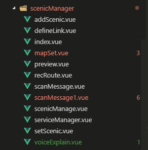
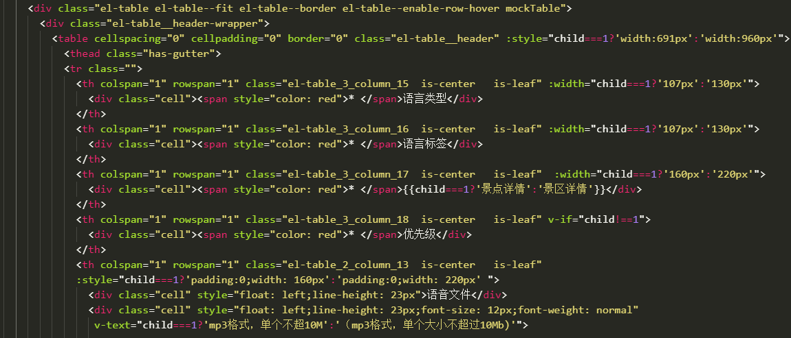

# 案例1

`无规范维护困难`  

先前的B端后台项目，录入景区信息一个大大大的模块(的前端部分)交由一个人完成，而后需要换人继续开发的时候就。。。  
没错需要啃那一大堆代码的是本人，啃两天之后因内部外部原因不再啃了我们这里只谈内部原因。 

__代码不好啃呀__ 
当然别人家的代码基本上都是不好啃的，尤其是这代码来自于你身边的人而不是你神往已久的大神， 这两种啃代码的心态是不一样的。 前者啃完之后肯定吐槽一句`哇这代码真难啃，xxx你坑到我了`， 后者则是`哦耶我终于把这段代码理解了`。

## 除去这个原因之后我们看细节  
  

- 拼写错误，嗯还行吧，轻微强迫症患者表示问题不大
- 全部文件平级，这个初看让人无所适从，当然方法还是有的，从路由定义看起顺藤摸瓜，嗯还是有办法继续的  
## 继续看

- 这一行的代码有点长了呀， 没关系IDE宽度拉一下
- 这内联样式结合class决定最终样式，嗯有时候偷懒自己也用一下，不过这里有点多啊，有点忍不了
- 细节: el-table前缀的一些奇怪的类名，那是element-ui提供的组件el-table, 这里不用el-table组件想必是那个组件满足不了需求，然后又想用人家的样式，嗯，这种做法不太好呀，甚至不如另起炉灶。

## 再看
``` javascript
    const maxSize = 10 * 1024 * 1024;
    const lastName = '.mp3';
    const { name } = file;
    const { size } = file;
```
这个就很熟悉，eslint在保存的时候帮忙把代码调整成 __对象解构赋值__了，然后并不理想(eslint并不能帮你写代码)。理想的是：  

``` javascript
    const { name, size } = file;
```

## 行了不看了
反正项目已经打出GG， 不如之后看看小岛的项目和我们lvji-h5的项目，同样存在着不少的问题


## 结论 
啃代码过程中各种 `还行吧`，`没关系`, 对代码的要求一直在让步。  
让步还是要有的毕竟看的代码不是自己的有这个预期，只是无奈的是啃完代码之后想的不是继续开发而是重构。 