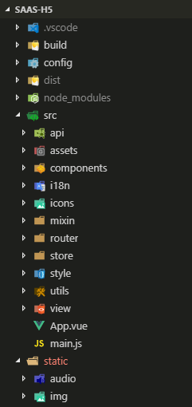

# 项目结构与框架
## 项目结构
项目结构这里指项目文件的结构，把文件按照 `功能或者文件性质` 放在对应的文件夹下，具体结构细节应根据实际项目框架来调整。  
### 现有项目案例  
  
上图为项目 [saas-h5](http://192.168.32.55:10086/H5/saas-h5) 的文件结构， 项目框架为 `vue`。 
细节介绍:  
  
 
| 文件夹 | 内容 | 备注 |
|:---:|:---|:--- |
| dist | 项目的输出，需要部署的文件全在里边了| |
| src/api | 定义服务端接口 | |
| src/assets | 项目内部的静态文件，不暴露在外部 | 相关： static|
| src/components | 公用组件 | |
| src/i18n | 国际化翻译文件 | |
| src/icons | svg图片 | |
| src/mixin | 公用mixin | | 
| src/router | 路由定义 | 项目是单页应用(SPA)，所以需要定义路由 | src/utils | 工具方法 | |
| src/style | 公用样式或者mixin | 这块不会那么严格有时候会把某个页面的样式抽出来放到这里 | 
| static | 项目部署时候可以通过url直接访问到的内容 | |

## 项目框架
在建立一个新的项目的时候， 需要综合考虑业务需求、项目紧急程度以及团队成员的技术栈，选一个目前最适合的框架。 如果项目不紧急可以考虑尝试新框架大家一起探索学习:)。

### 目前公司已经用到的一些框架
| 框架 | 项目 | 备注 |
|:---:|:---|:--- |
| vue | 各类B端后台前端项目、saas-h5、saas管理后台前端项目  | 没啥要说的 |
| react | 待补充 | 待补充 |
| taro | 待补充 | 待补充 |

其中 `taro` 是基于 `react` 的另一个框架。 

### 种子项目
`框架 x 业务` 在公司应该有不同的 __种子项目__ 。  
当开展新项目的时候可以直接 __copy__ 或者 __fork__ 出来一份进行修改，省去重复搭建项目框架的时间。如果在项目开发中发现种子项目存在一些问题，则可以考虑在项目结束之后将本项目中的修改或者优化提取出来，让种子项目更加完善。

我们的各类B端项目大都基于 __小岛项目__(关于此项目，之后的案例中会提到) ，这个项目包括一 小程序，H5，后台代码前端项目，以及后端的java服务项目。

### 需要的种子项目 
__小岛项目__ 这种种子项目， 因为需求基本是在一个完成的产品上做一些修改(这些修改更多来自于客户，甲方爸爸)，所以我们的实际执行的时候copy的是整个项目，而不仅仅是项目的框架设计部分。  
这类当然也叫种子项目但是跟这里的不太一样。 因为需求是未知的，对于新项目，我们能掌握的信息应该只有是H5， 是后台管理系统等这样比较模糊的东西。但是我们能 __从以往的项目中总结出一些共性的东西__，把这些东西抽离出来，就是我们的种子项目了。

| 新业务类型 | 种子项目要求 |
| --- | --- |
| 移动端H5 | 完整的项目结构，构建脚本，部署方式，基本路由, 国际化， 移动端布局适配方案， 一些常用的utils比如判断设备型号等 |
| PC端后台 | 基本同上(嗯后台一般不需要国际化)，外加一般化的后台整体布局，粒度到按钮级别的权限控制 |
| 小程序外壳 | 用户授权，和webview交互，国际化 |

### 目前状态 
目前并没有一个正式的种子项目的概念，基本上在创建新项目的时候会看目前哪个已有项目合适一些，直接copy过来这样

